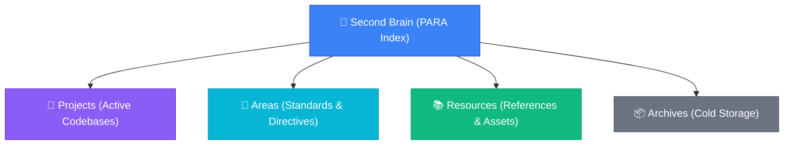

# Obsidian PARA Index & MOC Generator

Scans your entire Obsidian knowledge vault across Tiago Forte's **PARA** architecture (*Projects, Areas, Resources, Archives*) and synthesizes an authoritative **Map of Content (MOC)** (`PARA-Index.md`) alongside a connected, spatial visual canvas (`PARA-Index.canvas`) at your vault root.

---

## 1. Trigger & Prerequisites

Run this skill:
- **On-Demand**: When the user asks to "index the vault", "generate an MOC", "create a master index", or runs `/obsidian-index`.
- **Post-Setup**: After running `/obsidian-setup` or bootstrapping a major new repository.

### Configuration Gate
Read `.agents/obsidian-config.json`:
1. Resolve `default_vault` (e.g. `<VaultName>`).
2. Resolve directory paths from `para`:
   - `projects_dir`: defaults to `"Projects"`
   - `areas_dir`: defaults to `"Areas"` (fallback: `legacy_fallbacks.system_dir` or `"System"`)
   - `resources_dir`: defaults to `"Resources"`
   - `archives_dir`: defaults to `"Archives"`
3. Resolve `provider`: defaults to `"auto"` (MCP toolset or Local REST API).

---

## 2. 4-Pillar Vault Discovery

Query the vault across each PARA quadrant:

### A. Projects Discovery (`Projects/`)
1. Search vault for all notes matching `scope: "<projects_dir>"` and `filename: "Overview"`.
2. For each discovered project:
   - Extract project name from parent folder name (e.g. `camwyn-agent-skills`).
   - Read frontmatter: `title`, `tech_stack`, `status`, `repo_path`.
   - Verify companion notes:
     - `Dashboard.canvas`
     - `Worklog.md`
     - `Tasks.md`
     - `Decisions.md`

### B. Areas Discovery (`Areas/`)
1. Search vault for all notes in `scope: "<areas_dir>"`.
2. Also check `legacy_fallbacks.system_dir` (e.g., `00 Company/` or `System/`).
3. For each note:
   - Extract title, type (`area-directive`), tags, and summary.
   - Categorize into: *Voice & Tone*, *Design Tokens*, *Architecture Principles*, or *Governance*.

### C. Resources Discovery (`Resources/`)
1. Search vault for all notes in `scope: "<resources_dir>"`.
2. Extract reference categories, API contracts, cheat-sheets, and prompt playbooks.

### D. Archives Discovery (`Archives/`)
1. Search vault for all notes in `scope: "<archives_dir>"`.
2. Categorize into:
   - Inactive / Sunset Projects (`Archives/Projects/`)
   - Historical Worklog Rotations (`Archives/Worklogs/` or `<Project>/Worklog-Archive-<YYYY>.md`)
   - Deprecated ADR logs.

---

## 3. Generate Master Map of Content (`PARA-Index.md`)

Write or update `PARA-Index.md` at the vault root (or `<para.system_dir>/PARA-Index.md`):

```markdown
---
title: "Second Brain — PARA Master Index"
type: map-of-content
tags:
  - moc
  - index
  - second-brain
  - para
updated_at: <YYYY-MM-DD HH:MM>
---

# Second Brain — PARA Master Index

Authoritative Map of Content (MOC) connecting all active codebases, operational standards, shared resources, and cold storage archives.

> 🧭 **Interactive Visual Map**: Open [[PARA-Index.canvas|Visual Second Brain Canvas]] for an interactive 2D spatial view.

---

## 🏗️ Architecture Topology



---

## 🚀 1. Projects (Active Initiatives)

Active codebases, deliverables, and goal-oriented repositories:

| Project | Tech Stack | Status | Quick Links |
|---|---|---|---|
| **[[Projects/<ProjectName>/Overview|<ProjectName>]]** | `<Tech1>, <Tech2>` | `Active` | [[Projects/<ProjectName>/Dashboard.canvas|Canvas]] · [[Projects/<ProjectName>/Worklog|Worklog]] · [[Projects/<ProjectName>/Tasks|Tasks]] · [[Projects/<ProjectName>/Decisions|Decisions]] |

### 📊 Reactive Project Directory (Dataview)
```dataview
TABLE status AS "Status", tech_stack AS "Tech Stack", file.mtime AS "Last Modified"
FROM "Projects"
WHERE type = "project"
SORT file.mtime DESC
```

---

## 📐 2. Areas (Standards & Directives)

Ongoing responsibilities and standards that govern all initiatives without a fixed end date:

| Standard / Area | Scope | Key Directive Note |
|---|---|---|
| **Voice & Tone** | Copy, documentation, agent dialogue | [[Areas/Tone and Voice|Tone & Voice Guidelines]] |
| **Design System** | UI styling, typography, HSL palettes | [[Areas/Design Tokens|Design System Tokens]] |
| **Architecture** | DRY, modular design, ADR rules | [[Areas/Architecture Principles|Architecture Principles]] |

### 📊 Reactive Directives Directory (Dataview)
```dataview
TABLE category AS "Category", file.folder AS "Location"
FROM "Areas"
WHERE type = "area-directive"
SORT file.name ASC
```

---

## 📋 3. Vault-Wide Active Tasks (Dataview)

Consolidated view of all uncompleted tasks across every active project:

```dataview
TASK
FROM "Projects"
WHERE !completed
GROUP BY file.folder
```

---

## 📚 4. Resources (Reference & Assets)

Reusable technical references, API contracts, prompt packs, and cheatsheets:

- [[Resources/README|Reference Index & Playbooks]]
- *(Discovered resource notes listed here)*

---

## 📦 5. Archives (Cold Storage)

Completed projects, deprecated systems, and rotated historical worklogs:

- [[Archives/README|Archives Index]]
- *(Rotated worklogs: [[Archives/Worklogs/...|Worklog Archives]])*
```

---

## 4. Generate Master Visual Canvas (`PARA-Index.canvas`)

Write `PARA-Index.canvas` to the vault root as a valid JSON document:

### Canvas Layout Geometry (4-Quadrant Star Topology):
- **Center Node (`hub`)**:
  - `x`: 0, `y`: 0, `width`: 380, `height`: 180, `color`: `"1"` (Purple)
  - Text: `# 🧠 Second Brain Master Index\n\nCentral cockpit connecting Projects, Areas, Resources, and Archives.`
- **Quadrant 1 (Top-Left): Projects Cluster (`x: -900, y: -450`)**:
  - Pillar Header Card: `x: -900, y: -450, width: 340, height: 140, color: "4"` (Cyan)
  - Project Nodes: Placed beneath header card (`x: -900, y: -250`), linking to `Projects/<Name>/Overview.md` and `Dashboard.canvas`.
- **Quadrant 2 (Top-Right): Areas Cluster (`x: 600, y: -450`)**:
  - Pillar Header Card: `x: 600, y: -450, width: 340, height: 140, color: "5"` (Emerald)
  - Area Nodes: `Areas/Tone and Voice.md`, `Areas/Design Tokens.md`, `Areas/Architecture Principles.md`.
- **Quadrant 3 (Bottom-Left): Resources Cluster (`x: -900, y: 350`)**:
  - Pillar Header Card: `x: -900, y: 350, width: 340, height: 140, color: "3"` (Yellow/Amber)
  - Resource Nodes: Reusable playbooks, API specs, and cheatsheets.
- **Quadrant 4 (Bottom-Right): Archives Cluster (`x: 600, y: 350`)**:
  - Pillar Header Card: `x: 600, y: 350, width: 340, height: 140, color: "6"` (Gray)
  - Archive Nodes: Rotated worklog archives and completed projects.
- **Connecting Edges**:
  - Directed arrows from `hub` to each of the 4 Pillar Header Cards.
  - Directed arrows from each Pillar Header to its constituent child nodes.

---

## 5. Verification & Output Receipt

Emit a clean, informative receipt in chat:
> 🗺️ **Obsidian PARA Index Generated**:
> - **Master MOC Note**: `[[PARA-Index|PARA-Index.md]]`
> - **Visual Spatial Canvas**: `[[PARA-Index.canvas|PARA-Index.canvas]]`
> - **Pillars Indexed**: `<P> Projects, <A> Areas, <R> Resources, <Arc> Archives`
