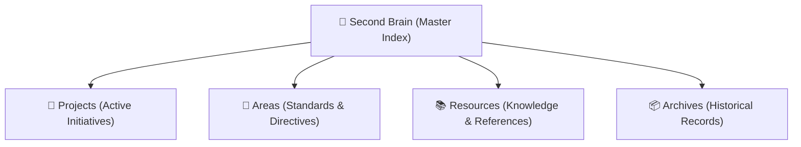

# Second Brain — Master Index (MOC)

Authoritative Map of Content (MOC) organizing all active projects, operational areas, shared resources, and archives.

---

## 🏗️ Architecture Overview



---

## 🚀 1. Projects (Active Initiatives & Sprints)

Active codebases, campaigns, client deliverables, and goal-oriented initiatives with clear completion criteria:

| Project | Domain / Area | Status | Scope / Focus | Quick Links |
| :--- | :--- | :--- | :--- | :--- |
| **[[Projects/_template-project/Overview\|Sample Project Alpha]]** | Operations | `Active` | Example project deliverable | [[Projects/_template-project/Worklog\|Worklog]] · [[Projects/_template-project/Tasks\|Tasks]] |

```dataview
TABLE status AS "Status", file.mtime AS "Last Modified"
FROM "Projects"
WHERE type = "project"
SORT file.mtime DESC
```

---

## 📐 2. Areas (Standards & Continuous Directives)

Long-term standards, governance models, and recurring responsibilities that govern initiatives without an end date:

| Domain Area | Lead MOC / Guide | Core Scope & Directives |
| :--- | :--- | :--- |
| **00 Brand & Strategy** | `[[Areas/README\|Strategy Overview]]` | `[[AI CONTEXT\|AI Constitution]]` |

---

## 📋 3. Vault-Wide Active Tasks

```dataview
TASK
FROM "Projects"
WHERE !completed
GROUP BY file.folder
```

---

## 📚 4. Resources (Reference Playbooks & Knowledge Hubs)

Curated knowledge bases, how-to guides, and reference playbooks organized by topic:

- 🎨 **Brand & Design**: Typography tokens, logo assets, visual guidelines.
- 💻 **Engineering & Systems**: Architecture decision records, API specs, dev playbooks.
- 📑 **Operations & Legal**: Templates, checklists, operating agreements.

---

## 📦 5. Archives (Historical Records & Sunset Initiatives)

- 📜 **Completed Milestones**: Historical records and project retrospectives.
- 🧪 **Retired Experiments**: Deprecated prototypes and exploratory drafts.
